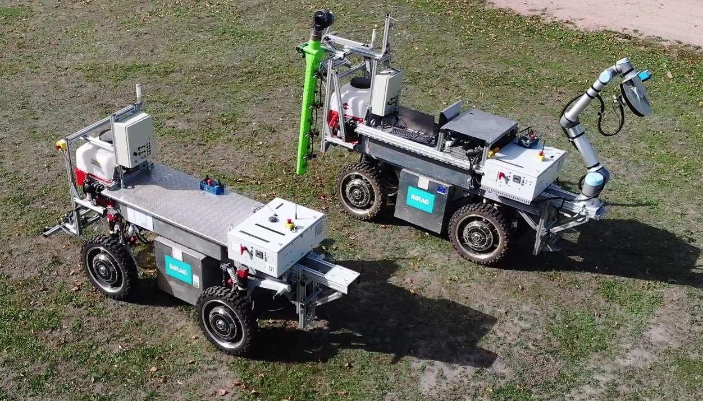
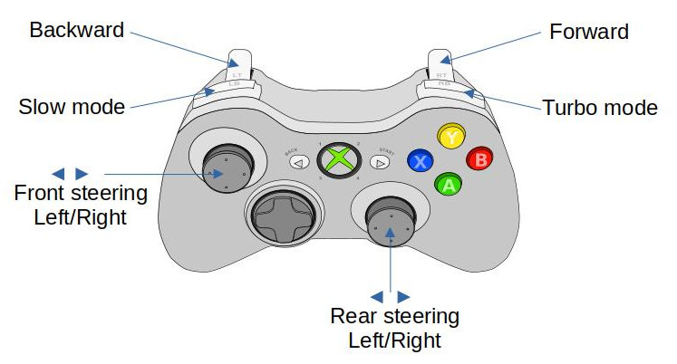
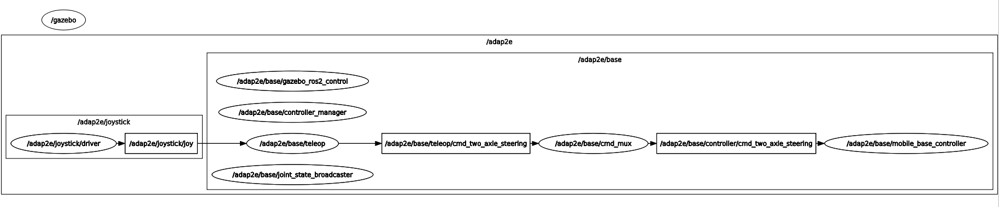

# adap2e_bringup

## 1) Overview

`adap2e_bringup` connects the Adap2e description, hardware, simulation and teleoperation packages to the generic `romea_mobile_base_meta_bringup` workflow.

It provides:

* robot-specific generation functions for configuration, URDF and `ros2_control` descriptions;
* launch files for live control, Gazebo simulation and teleoperation;
* controller manager and mobile base controller parameter files;

The supported Adap2e variants are `one` and `two`. Both variants use the `4WS4WD` mobile base architecture.



## 2) Generated artifacts

The Python module `adap2e_bringup` delegates most generation work to `adap2e_description` and adds bringup-specific configuration such as the controller manager parameter file.

It provides the functions expected by `romea_mobile_base_meta_bringup`:

| Function | Purpose |
|---|---|
| `get_configuration(robot_model)` | returns the compact mobile base configuration for `one` or `two` |
| `generate_configuration_file(robot_model, extended)` | generates the mobile base configuration file |
| `generate_urdf_description(prefix, mode, base_name, robot_model, ros_prefix)` | generates the Adap2e URDF description |
| `generate_ros2_control_description(prefix, mode, base_name, robot_model)` | generates the Adap2e `ros2_control` description |

The executable scripts in `scripts/` expose these functions from the command line:

The configuration generator writes the compact `4WS4WD` mobile base configuration used by controllers, teleoperation and launch files. It is derived from the selected Adap2e robot configuration in `adap2e_description/config/`.

```bash
ros2 run adap2e_bringup generate_configuration_file.py \
  robot_model:one \
  extended:false
```

The URDF generator writes the Adap2e robot description for the selected variant. It contains the `4WS4WD` link and joint structure, inertial data, collision geometry, visual meshes and the simulator plugin block when a simulation mode is selected.

```bash
ros2 run adap2e_bringup generate_urdf_description.py \
  robot_namespace:adap2e \
  base_name:base \
  robot_model:one \
  mode:simulation_gazebo
```

The `ros2_control` generator writes the hardware description consumed by `controller_manager`. It declares the hardware plugin selected by the mode, the geometric hardware parameters and the command/state interfaces for all steering and spinning joints.

```bash
ros2 run adap2e_bringup generate_ros2_control_description.py \
  robot_namespace:adap2e \
  base_name:base \
  robot_model:one \
  mode:live
```

## 3) Launch files

### 3.1) Base launch

`launch/adap2e_base.launch.py` starts the Adap2e mobile base control stack.

It:

* receives the generated robot URDF and `ros2_control` description from the meta-bringup launch context;
* starts `controller_manager/ros2_control_node` in non-Gazebo modes;
* loads `joint_state_broadcaster`;
* loads `mobile_base_controller` using `romea_mobile_base_controllers/MobileBaseController4WS4WD`;
* starts `romea_cmd_mux` and remaps its output to `controller/cmd_two_axle_steering`.

Main launch arguments are:

| Argument | Description |
|---|---|
| `mode` | execution mode, such as `live`, `simulation_gazebo` or `simulation_gazebo_classic` |
| `robot_model` | Adap2e variant, `one` or `two` |
| `robot_namespace` | namespace of the robot |
| `base_name` | namespace of the mobile base, usually `base` |

### 3.2) Teleoperation launch

`launch/adap2e_teleop.launch.py` starts the mobile base teleoperation stack through `romea_mobile_base_teleop`.

It uses:

* the selected Adap2e robot configuration from `adap2e_description/config/`;
* the joystick configuration file, usually selected from the `config/` directory of `romea_joystick_utils` according to the joystick type;
* the teleoperation configuration from `adap2e_description/config/teleop.yaml` by default.

The teleoperation node publishes `romea_mobile_base_msgs/TwoAxleSteeringCommand`, consistent with the `4WS4WD` controller command type.

To move the robot, the operator must hold either the slow mode or turbo mode button. The joystick axes then command the front and rear steering angles and the longitudinal speed.

Main launch arguments are:

| Argument | Description |
|---|---|
| `mode` | execution mode, used to configure simulation time |
| `robot_model` | Adap2e variant, `one` or `two` |
| `joystick_topic` | joystick `sensor_msgs/msg/Joy` topic |
| `joystick_configuration_file_path` | joystick configuration file, usually selected from `romea_joystick_utils/config/` |
| `teleop_configuration_file_path` | teleoperation configuration file, defaulting to `adap2e_description/config/teleop.yaml` |



### 3.3) Gazebo launch

`launch/adap2e_gazebo.launch.py` starts a Gazebo or Gazebo Classic simulation and spawns the Adap2e entity from the generated URDF.

It supports:

* `simulation_gazebo`, using `ros_gz_sim` and `gz_ros2_control`;
* `simulation_gazebo_classic`, using `gazebo_ros` and `gazebo_ros2_control`.

The `ros2_control` hardware plugin used in simulation is selected by `adap2e_description` from the generated `mode`.

Main launch arguments are:

| Argument | Description |
|---|---|
| `mode` | simulation mode, usually `simulation_gazebo` or `simulation_gazebo_classic` |
| `robot_model` | Adap2e variant, `one` or `two` |
| `robot_namespace` | namespace of the robot and simulation entity |
| `base_name` | namespace of the mobile base, usually `base` |

### 3.4) Implement teleoperation launch

`launch/adap2e_implement_teleop.launch.py` starts the joystick teleoperation node used for an implement or arm mounted on the Adap2e platform.

It uses the joystick type, joystick driver and joystick topic to build the implement teleoperation mapping.

### 3.5) Test launch

`launch/adap2e_test.launch.py` starts a compact test setup with:

* the Adap2e simulation when the selected mode contains `simulation`;
* the Adap2e base launch;
* the Adap2e teleoperation launch;
* a joystick node using the selected joystick model.

In simulation mode, the controller manager is provided by the Gazebo integration. In live mode, the base launch starts the standard `controller_manager/ros2_control_node`.

Main launch arguments are:

| Argument | Description |
|---|---|
| `mode` | execution mode, usually `simulation_gazebo` for this test setup |
| `robot_model` | Adap2e variant, `one` or `two` |
| `joystick_model` | joystick model used to select the default joystick configuration, such as `microsoft_xbox` or `sony_dualshock4` |

The following diagram gives an overview of the control pipeline started by this test launch file.



## 4) Configuration files

The `config/` directory contains:

| File | Purpose |
|---|---|
| `controller_manager.yaml` | declares `joint_state_broadcaster` and `MobileBaseController4WS4WD` |
| `mobile_base_controller.yaml` | provides common runtime parameters for the mobile base controller |

The robot geometry, inertia, joint names and teleoperation defaults are stored in `adap2e_description/config/`.

## 5) Relation with the meta-bringup workflow

`adap2e_bringup` is the robot-specific extension used when a mobile base meta-description selects:

```yaml
configuration:
  manufacturer: inrae
  model: adap2e
  version: one
```

or:

```yaml
configuration:
  manufacturer: inrae
  model: adap2e
  version: two
```

In that workflow:

* `romea_mobile_base_meta_bringup` reads the mobile base meta-description;
* `adap2e_bringup` generates Adap2e-specific configuration, URDF, `ros2_control` and launch artifacts;
* `adap2e_description` provides the concrete robot model;
* `adap2e_hardware` is used in `live` mode;
* `romea_mobile_base_gazebo` or `romea_mobile_base_gazebo_classic` is used in Gazebo simulation modes;
* `romea_mobile_base_teleop` starts the matching two-axle steering teleoperation node.
