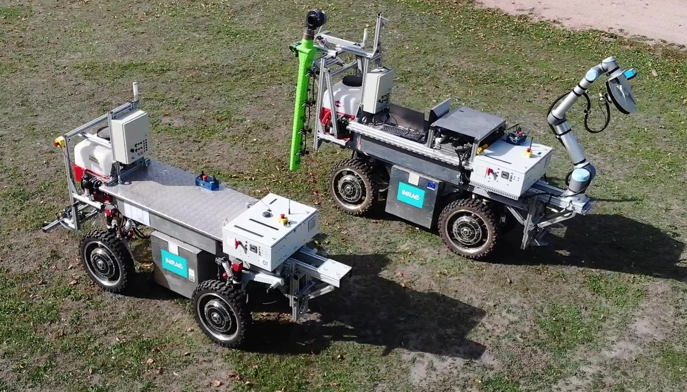

# adap2e_bringup #

## 1 Launch files ##

The adap2e_bringup package provides a suite of launch files enabling both manual and automated control of  Adap2e robots, either in real-time or in simulation. Two robot models are supported (see figure below): the Adap2e Slim, and the Alpo Fat, which differ only in track width. Additionally, both models can be equipped with a robotic arm mounted at the front.



### 1.1 Base launch file ###

The **adap2e_base.launch.py** file, located in the launch directory, is responsible for starting the controller manager, the robot's controller, and a command multiplexer. The configuration of the controller manager and the robot controller are defined in the **controller_manager.yaml** and **mobile_base_controller.yaml** files, respectively, which are located in the config directory. By default, the **MobileBaseController4WS4WD** controller, provided by the **romea_mobile_base_controller** package, is used to operate Adap2e robots.


You can launch these nodes via command line:

```console
ros2 launch adap2e_bringup adap2e_base_launch.py mode:=simulation robot_namespace:=adap2e robot_model:=fat base_name:=base
```

where:
- ***mode*** (choices: ***simulation*** or ***live***) defines the demonstration mode.  
- ***robot_model*** (choices: ***fat*** or ***slim***) defines the robot model.
- ***robot_namespace*** (default: ***alpo***) sets the main ROS namespace where all Adap2e nodes are launched. 
- ***base_name*** (default: ***base***) sets the ROS sub-namespace in which controller nodes are launched
`

### 1.2 Teleop launch file ###

The **adap2e_teleop.launch.py** file, located in the launch directory, is used to execute the **two_axle_steering_teleop_node** provided by the **romea_teleop_drivers** package to control the motion of the Adap2e robot. You can launch the teleop node via the command line:

```console
ros2 launch adap2e_bringup adap2e_teleop.launch.py robot_model:=fat joystick_type:=xbox joystick_driver:=joy joystic_topic:=joystick/joy teleop_configuration_file_path:=/path_to_file/teleop.yaml
```

where:

- ***robot_model*** (choices: ***fat*** or ***slim***) specifies of the robot model
- ***joystick_type*** (choices: ***xbox*** or ***dualshock4***) specifies the type of joystick
- ***joystick_driver*** (choices: ***joy*** or ***ds4_driver***, default: ***joy***) defines the ROS2 driver package used to control the joystick
- ***joystic_topic*** (default: **joystick/joy**) defines the name of the output topic of the  joystick node 
- ***teleop_configuration_file_path*** specifies the absolute path of teleoperation configuration file 

The default teleop configuration file can be found in the config directory of the **adap2e_description** package, and the joystick mapping can be found in the config directory of the **romea_teleop_description** package. To move the robot, hold down either the slow mode or turbo mode button. Use the control sticks to adjust the front and rear steering angles, and the triggers to control the robot's speed.


## 2.3 Test launch file

The **adap2e_test.launch.py** file, located in the launch directory, is used to test the robot control pipeline in both live and simulation contexts. The following nodes are launched: controller manager, robot controller, joystick node, and teleop node using an Xbox joystick.

```console
ros2 launch adap2_bringup adap2e_test.launch.py robot_model:=fat mode:=simulation
```

where:

- ***mode*** (choices: ***simulation*** or ***live***) defines the demonstration mode,   
- ***robot_model*** (choices: ***fat*** or ***slim***) defines the model of the robot

Below, you can see the ROS pipeline when selecting the simulation mode with the fat adap2e. In live mode, the pipeline remains the same, except that the **gazebo_ros2_controller_manager** is replaced by a standard **ros2_controller_manager**.


# 2 URDF description:

You can generate the URDF description of the Adap2e robot using the **urdf_description.py** executable located in the scripts directory.

```console
ros2 run adap2e_bringup urdf_description.py robot_model:fat mode:simulation base_name:base robot_namespace:adap2e > adap2e.urdf
```

where:

- ***base_name***  defines the name of robot mobile base  
- ***mode*** (choices: ***simulation*** or ***live***) defines the demonstration mode,  
- ***robot_model*** (choices: ***fat*** or ***slim***) defines the model of the robot,
- **robot_namespace** is the namespace in which the ROS2 nodes are launched. It is also used as a prefix for link and joints of the mobile base. 
